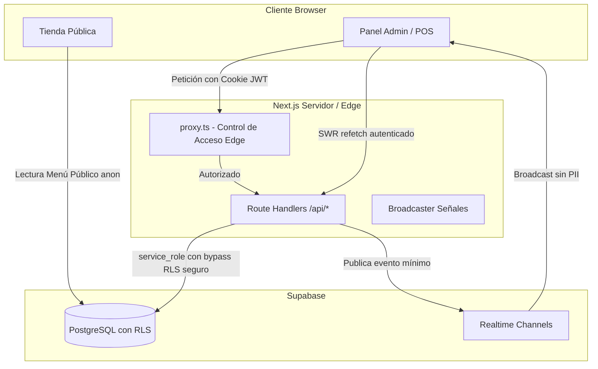

# Arquitectura del Sistema — Chefsy

## 1. Visión General y Propósito

Chefsy es una plataforma integral para locales gastronómicos y dark kitchens. El sistema unifica en un único proyecto Next.js (App Router):
1. **Tienda pública interactiva** para pedidos directos y seguimiento por GPS.
2. **Sistema Punto de Venta (POS) y Gestión Operativa** para salón, cocina, cadetería y caja.
3. **Plataforma de despacho y tracking en tiempo real** para repartidores y clientes.
4. **Módulo de impresión térmica** para comandas de cocina y tickets de entrega.

---

## 2. Stack Tecnológico

| Capa | Tecnologías | Notas clave |
|---|---|---|
| **Framework Web** | Next.js 16.3.3 (App Router) + Turbopack | Usa convención `proxy.ts` para intercepción de rutas. |
| **Librería UI** | React 18 + TypeScript 5 | Tipado estricto (`strict: true`). |
| **Estilos** | Tailwind CSS 3, Radix UI Primitives, Lucide React | Interfaz responsiva Desktop y Mobile First. |
| **Animación & Scroll** | Framer Motion, Lenis | Transiciones fluidas en catálogo e interacción táctil. |
| **Base de Datos & Backend** | Supabase (PostgreSQL 15+, Auth, Realtime, Storage) | RLS estricto; cliente `service_role` en servidor. |
| **Gestión de Estado** | SWR + Context API (`useReducer` / `useState`) | Caché local con TTL (`lib/localCache.ts`). |
| **Mapas & Geolocalización** | Leaflet + React-Leaflet (`dynamic(..., { ssr: false })`) | MapLibre GL en rutas experimentales 3D. |
| **Tokens & Sesión** | `jose` (JWT) + `bcryptjs` | Cookies seguras `HttpOnly` y sesiones separadas para staff y clientes. |

---

## 3. Subconjuntos de la Aplicación

### A. Tienda Pública (`/`, `/tienda`)
- **Montaje responsivo optimizado**: Para mitigar desajustes de hidratación en navegadores incrustados (Instagram, TikTok, Safari móvil), la tienda principal en [`app/page.tsx`](file:///c:/Users/lauta/Desktop/chefsy/app/page.tsx) se carga dinámicamente mediante `next/dynamic` con `{ ssr: false }`, alternando entre `TiendaMobile` y `TiendaDesktop` una vez detectado el ancho del cliente.
- **Flujo de compra**: Selección de productos (hamburguesas, lomitos, pizzas, bebidas), personalización de modificadores, cálculo de envío por polígonos/distancia, persistencia en [`CarritoContexto.tsx`](file:///c:/Users/lauta/Desktop/chefsy/contexto/CarritoContexto.tsx) y despacho hacia la API o derivación estructurada por WhatsApp.

### B. Panel Operativo y POS (`app/(principal)/*`)
Estructurado como grupo de rutas protegido por [`proxy.ts`](file:///c:/Users/lauta/Desktop/chefsy/proxy.ts) con un layout común (`Sidebar` + `Header`):
- `/pedidos`: Gestión operativa de pedidos con vista de cuadrícula predeterminada o lista vertical (modo kanban retirado).
- `/cadeteria` y `/torre-control`: Gestión de despacho, asignación de cadetes y mapa global.
- `/cierre`: Cierre de caja por turnos, arqueo de efectivo y comparativas de facturación.
- `/productos`: Gestión interna de catálogo, visibilidad y precios (artículos de empanadas y sus flujos de cocción retirados).
- `/configuracion`: Configuración del local. El módulo de stock se encuentra dormido y oculto de la navegación principal (Sidebar y BottomNav), manteniendo intactos los motores de kardex en segundo plano para reactivación futura.
- `/clientes`: CRM de clientes, historial y detección de registros duplicados.

### C. Seguimiento GPS en Vivo (`/cadete-en-vivo/[id]`)
- Pantalla pública de seguimiento para el cliente final.
- Consume las coordenadas del cadete asociado al pedido vía API y mapa reactivo.

### D. Impresión de Tickets (`/imprimir/[id]`)
- Renderiza una vista minimalista formateada específicamente para impresoras térmicas de 58 mm / 80 mm.
- Es invocado automáticamente desde el panel de pedidos dentro de un `iframe` oculto que dispara `window.print()`.

---

## 4. Flujo de Datos y Realtime



### El patrón de Realtime: Señal vs Datos
Para garantizar que ninguna tabla que contenga información personal o confidencial (PII) de clientes o facturación sea leída con la clave anónima desde el navegador:
1. Las operaciones de mutación se realizan mediante Route Handlers (`app/api/*`) autenticados usando [`obtenerSupabaseAdmin()`](file:///c:/Users/lauta/Desktop/chefsy/lib/supabase-admin.ts).
2. Al registrarse un cambio en un pedido o cadete, el backend o servicio emite un mensaje ligero mediante canales `broadcast` de Supabase (`lib/pedidos-broadcast.ts` y `lib/cadetes-broadcast.ts`).
3. El cliente (dashboard/cadetería) recibe el aviso de que existió una modificación y dispara un `refetch` / `mutate` mediante SWR hacia la API interna autenticada.

---

## 5. Reglas de Oro de Arquitectura y Gotchas

1. **UI reutilizable con shadcn/ui**:
   Para código nuevo, utilizar los componentes compatibles con shadcn/ui existentes en `components/ui/` siempre que cubran la necesidad. Si falta una pieza, consultar la biblioteca local de referencia disponible durante el desarrollo en `C:\\Users\\lauta\\Desktop\\flota-web\\components\\ui`, y copiar/adaptar el componente dentro de Chefsy en lugar de importar desde otro proyecto. Las implementaciones propias quedan reservadas para comportamientos específicos del dominio o cuando no exista un componente adecuado.
2. **Next.js 16 — Parámetros Asíncronos**:
   En App Router (Next 16), `params` y `searchParams` en componentes de servidor son `Promise`. En rutas dinámicas debe utilizarse:
   ```ts
   export default async function Page({ params }: { params: Promise<{ id: string }> }) {
     const { id } = await params;
   }
   ```
2. **Componentes con Acceso al DOM o Leaflet**:
   Cualquier mapa (`MapaSeguimiento`, `MapaSelector`) o librería que invoque `window` o `navigator` durante la inicialización debe importarse dinámicamente con `{ ssr: false }`.
3. **Actualizaciones Optimistas en SWR**:
   Al modificar o cancelar un pedido desde [`PedidosContexto.tsx`](file:///c:/Users/lauta/Desktop/chefsy/contexto/PedidosContexto.tsx), se aplica mutación optimista local (`mutate(..., false)`) para una experiencia de usuario instantánea sin saltos de interfaz antes de la confirmación remota.
4. **Respaldo Estático Offline**:
   El archivo [`datos/productos.ts`](file:///c:/Users/lauta/Desktop/chefsy/datos/productos.ts) opera como respaldo estático si la base de datos demora en responder o ante contingencias de red. Al modificar el modelo del catálogo, debe conservarse compatibilidad con este fallback.
