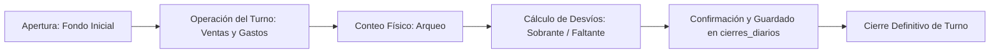

# Operaciones — Cierre de Caja y Arqueo de Turnos

## 1. Propósito y Alcance

El módulo de cierre de caja ([`/cierre`](file:///c:/Users/lauta/Desktop/chefsy/app/(principal)/cierre/page.tsx)) permite conciliar las operaciones monetarias del local al finalizar un turno de trabajo (mediodía o noche) o al concluir la jornada diaria.

Su objetivo es:
- Registrar el dinero físico real presente en caja (arqueo).
- Comparar las ventas del sistema contra los montos efectivamente cobrados por cada medio de pago.
- Imputar retiros de efectivo, gastos de caja chica y rendiciones de cadetes.
- Calcular sobrantes o faltantes de caja.

---

## 2. Flujo Operativo del Cierre de Turno

1. **Apertura de Turno**: Se define el fondo inicial de cambio en caja.
2. **Consolidación de Métodos de Pago**:
   - **Efectivo**: Dinero recibido en caja física o cobrado por cadetes.
   - **Transferencias**: Cobros bancarios o billeteras virtuales (Mercado Pago, etc.).
   - **Tarjetas**: Comprobantes de POSNET / tarjeta de crédito o débito.
3. **Gastos y Retiros**: Salidas de dinero asentadas durante el turno para compras menores o adelantos.
4. **Arqueo Físico**: Conteo de billetes cargado por el cajero o encargado.
5. **Cierre y Comparativa**: El sistema calcula la diferencia matemática. Al confirmar, los pedidos del turno quedan consolidados y el turno se da por finalizado.

---

## 3. Seguridad de Datos Financieros

- **Bloqueo RLS**: La tabla `cierres_diarios` y los registros de facturación están bloqueados a la clave anónima vía `001_rls_cierra_pagos_y_config.sql`.
- **Rutas Seguras**: Los componentes de comparativa en vivo ([`ComparativaTurnoVivo.tsx`](file:///c:/Users/lauta/Desktop/chefsy/components/cierre/ComparativaTurnoVivo.tsx)) consultan el endpoint administrativo `/api/admin/comparativa`, el cual exige rol `admin` y emplea `service_role` en el servidor, retornando únicamente las columnas numéricas estrictamente necesarias.
